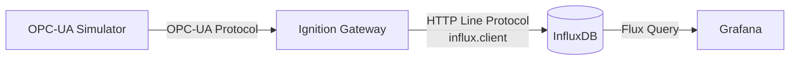
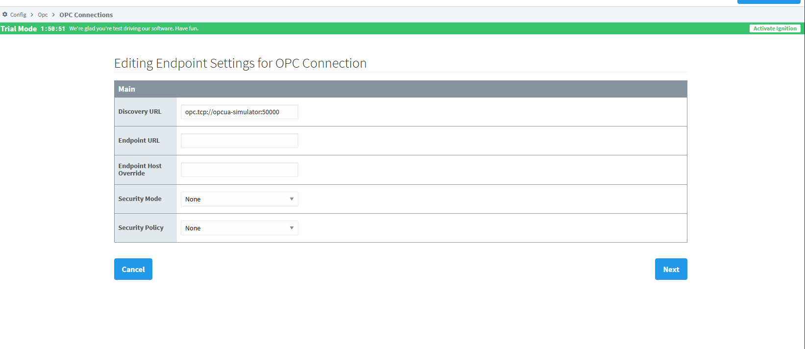
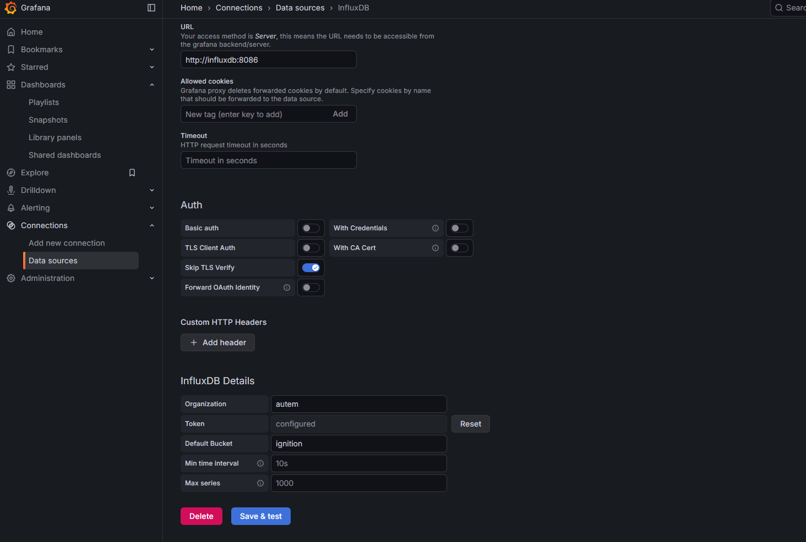

# Ignition → InfluxDB → Grafana Lab

A self-contained Docker lab that connects an OPC-UA simulator to Ignition Gateway,
historizes tag data to InfluxDB via a custom script library, and visualizes it in Grafana.

## Architecture



## Services

| Service              | Port  | Credentials         |
|----------------------|-------|---------------------|
| **Ignition**         | 8089  | admin / password    |
| **OPC-UA Simulator** | 50000 | —                   |
| **InfluxDB**         | 8086  | admin / password123 |
| **Grafana**          | 3000  | admin / admin       |

**InfluxDB Configuration:**

| Parameter        | Value               |
|------------------|---------------------|
| **Organization** | `acme-corp`         |
| **Bucket**       | `ignition`          |
| **Token**        | `secret-auth-token` |

## Quick Start

```bash
docker compose up -d
```

| Step | Action                                  | URL                                            |
|------|-----------------------------------------|------------------------------------------------|
| 1    | Configure OPC-UA connection in Ignition | [http://localhost:8089](http://localhost:8089) |
| 2    | Set Gateway Scripting Project           | Ignition Config → Gateway Settings             |
| 3    | Create tags and historize to InfluxDB   | Ignition Designer                              |
| 4    | View dashboard in Grafana               | [http://localhost:3000](http://localhost:3000) |

## Configuration

> [!IMPORTANT]
> You can skip steps 1-3 if you restore the provided backup (`./backup/ignition_backup.gwbk`) in the Ignition Gateway.

### 1. Ignition — OPC-UA Connection

1. Open Ignition: [http://localhost:8089](http://localhost:8089)
2. Navigate to **Config → OPC UA → Connections**
3. Create a new connection:
   - **Endpoint URL**: `opc.tcp://opcua-simulator:50000`
   - **Security Policy**: None
4. Save and verify the connection is active



### 2. Ignition — Gateway Scripting Project

The lab includes a script library (`influx.client`) for writing data to InfluxDB.
Tag change scripts and gateway timer scripts run in the **Gateway scope**, which requires
a designated scripting project.

1. Go to **Config → Gateway Settings**
2. Set **Gateway Scripting Project** to your project name (e.g. `InfluxDB_Historian`)
3. Save

> [!IMPORTANT]
> Without this step, tag scripts will fail with:
> `NameError: global name 'influx' is not defined`

### 3. Ignition — Script Library (`influx.client`)

The project includes a reusable library under **Script Library → influx → client**
that wraps the InfluxDB 2.x Line Protocol API.

#### Single write (e.g. tag change script)

```python
def valueChanged(tag, tagPath, previousValue, currentValue, initialChange, missedEvents):
    influx.client.write(
        measurement="temperature",
        tags={"source": "opcua", "station": "line1"},
        fields={"value": currentValue.value}
    )
```

#### Batch write — recommended (e.g. Gateway Timer Script)

For high-frequency tags (≥1 change/sec), use a **Gateway Timer Script** instead
of individual tag change scripts to avoid missed events:

```python
# Gateway Timer Script — runs every 1000ms, dedicated thread
TAG_CONFIG = [
    {
        "tagPath": "[default]Boiler1/Temperature",
        "measurement": "temperature",
        "tags": {"source": "opcua", "station": "line1"}
    },
    {
        "tagPath": "[default]Boiler1/Pressure",
        "measurement": "pressure",
        "tags": {"source": "opcua", "station": "line1"}
    },
]

influx.client.writeTagBatch(TAG_CONFIG)
```

> [!NOTE]
> **Why batch?** A single HTTP POST writes all points at once — no missed events,
> no thread pool exhaustion, and consistent sampling intervals regardless of tag count.

### 4. Grafana — Pre-configured Dashboard

The lab provisions a dashboard and InfluxDB data source automatically on startup.

Access: [http://localhost:3000](http://localhost:3000)

The dashboard includes:

- **Temperature time series**
- **Average temperature**
- **Current temperature**

> [!NOTE]
> On first launch, you may need to go to **Connections → Data sources** in Grafana
> and click **Save & Test** on the InfluxDB data source to verify the connection.
>
> 

<details>

<summary><strong>Manual Data Source Setup</strong> (if needed)</summary>

1. Go to **Connections → Data sources → Add data source → InfluxDB**
2. Configure:
   - **Query Language**: `Flux`
   - **URL**: `http://influxdb:8086`
   - **Organization**: `acme-corp`
   - **Token**: `secret-auth-token`
   - **Default Bucket**: `ignition`
3. Save & Test

</details>

## Teardown

```bash
# Stop containers (keep data)
docker compose down

# Stop containers and delete all data
docker compose down -v
```
