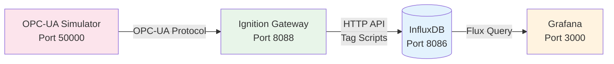

# Lab Ignition OPC → InfluxDB → Grafana

## Architecture



## Services

| Service              | Port  | Credentials         |
|----------------------|-------|---------------------|
| **Ignition**         | 8088  | admin / password    |
| **OPC-UA Simulator** | 50000 | -                   |
| **InfluxDB**         | 8086  | admin / password123 |
| **Grafana**          | 3000  | admin / admin       |

**InfluxDB Configuration:**

- **Organization**: `acme-corp`
- **Bucket**: `ignition`
- **Token**: `secret-auth-token`

## Quick Start

1. **Start the lab**: `docker compose up -d`
2. **Configure OPC-UA connection** in Ignition (see below)
3. **Create tags** and add value change script to historize to InfluxDB
4. **View dashboard** in Grafana: [http://localhost:3000](http://localhost:3000)

## Configuration

### 1. Ignition - OPC-UA Connection

1. Go to Ignition: [http://localhost:8089](http://localhost:8089)
2. Navigate to **Config** → **OPC UA** → **Connections**
3. Create new connection:
   - **Endpoint URL**: `opc.tcp://opcua-simulator:50000`
   - **Security Policy**: None
   - Save and test connection


### 2. Ignition - Tag Configuration & InfluxDB Historization

1. **Create tags** from OPC-UA server in **Config** → **Tags**
2. **Add Value Change Script** on tag to write to InfluxDB:

```python
def valueChanged(tag, tagPath, previousValue, currentValue, initialChange, missedEvents):
	influx.client.write(
	    measurement="temperature",
	    tags={"source": "opcua", "station": "line1"},
	    fields={"value": currentValue.value}
	)
```

A mini library is included in the lab to simplify writing to InfluxDB from tag scripts/timers. The `influx` object is available globally in the Ignition scripting environment.

### 3. Grafana - Pre-configured Dashboard

The lab includes a pre-configured dashboard showing:

- **Temperature time series** (last hour)
- **Average Temperature** (5 min average)
- **Current Temperature** (last data point)

Access: [http://localhost:3000/d/temperature-opcua](http://localhost:3000/d/temperature-opcua)

> [!NOTE]
> You might need to go to **Connections** > **Data sources** in Grafana and click **Save & Test** on the InfluxDB data source to refresh the connection.
> 


**Manual Data Source Setup** (if needed):

1. Go to **Connections** → **Data sources** → **Add data source** → **InfluxDB**
2. Configure:
   - **Query Language**: `Flux`
   - **URL**: `http://influxdb:8086`
   - **Organization**: `acme-corp`
   - **Token**: `secret-auth-token`
   - **Default Bucket**: `ignition`
3. Save & Test
